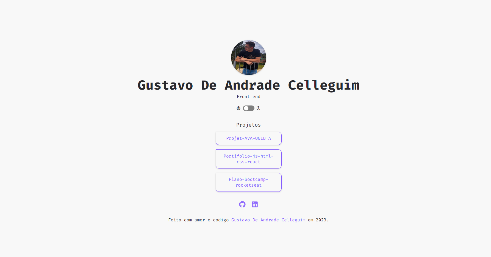
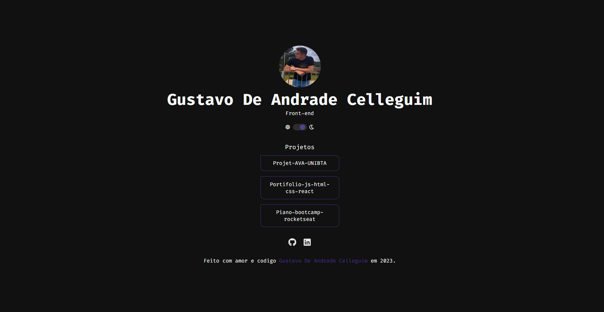

<h1 align= "center">
  Linketree - Projeto Rocketseat 
</h1>

---

Projeto de Introdução ao Desenvolvimento Web com Linktree Clone

Na jornada de preparação para o mercado de trabalho de desenvolvimento web, a Rocketseat propõe um emocionante projeto para expandir suas habilidades e criar uma aplicação prática. Este projeto consiste em criar uma árvore de links, semelhante ao famoso serviço Linktree, para organizar e compartilhar links importantes.

Tecnologias e Conceitos Envolvidos:

HTML: Construa a estrutura da página, definindo os elementos e links que serão exibidos na árvore.

CSS: Personalize o visual da sua árvore de links, escolhendo esquemas de cores e estilos que se adequem ao seu gosto ou marca pessoal.

JavaScript: Implemente a interatividade, permitindo aos usuários adicionar, remover e reorganizar os links de maneira amigável e responsiva.

Font Awesome: Utilize esta biblioteca de ícones para adicionar ícones atraentes e informativos aos seus links, tornando a experiência do usuário ainda mais agradáve

## Construido com

- HTML
- CSS
- Javascript
- Font Awesome, para ícones

---

  Desenvolvido por <a href="https://github.com/GusCelleguim "> Gustavo De Andrade Celleguim </a>

